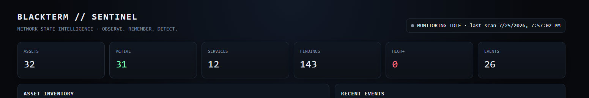

# 🛰️ BLACKTERM // SENTINEL

### NETWORK STATE INTELLIGENCE

> **Observe the network.**  
> **Remember the baseline.**  
> **Detect the change.**

**BLACKTERM // SENTINEL** is a defensive, Go-based network visibility and continuous monitoring engine for networks and systems you own or are explicitly authorized to test.

Sentinel discovers assets, fingerprints exposed services, builds persistent network state, detects changes over time, performs defensive security analysis, inventories web interfaces, and presents the results through both a CLI and local dashboard.

**Current release: v0.5.0**

---

## Overview

Sentinel is built around a simple idea:

```text
Discover → Fingerprint → Inventory → Analyze → Baseline → Monitor → Alert
```

Instead of treating every run as an isolated port scan, Sentinel remembers what it has observed. That allows it to answer more useful questions:

- What assets exist on this network?
- Which hosts are currently responsive?
- What services are exposed?
- What changed since the previous observation?
- Did a new service appear?
- Did an asset disappear?
- Which web interfaces are available?
- Which observations deserve security review?
- What has happened over time?

Sentinel is intentionally defensive. It does not attempt to recover credentials, bypass authentication, or exploit discovered systems.

---

## v0.5 Highlights

### Asset Intelligence
Sentinel maintains persistent asset records with:

- IPv4 address
- Hostname
- MAC address when observable
- Device classification
- First seen
- Last seen
- Observation count
- `NEW`, `ACTIVE`, `STALE`, and `OFFLINE` state

Device classification can identify useful categories such as IoT, mobile, workstation, and network infrastructure while preserving `UNKNOWN` when confidence is insufficient.

### Network Discovery

Discovery combines multiple observations rather than relying on one signal:

- Neighbor/ARP information
- ICMP reachability where available
- TCP service discovery
- Historical asset reconciliation
- Concurrent scanning with bounded worker pools
- Rate limiting and connection timeouts

### Service Fingerprinting

Sentinel fingerprints exposed services and records them as part of network state.

Examples include:

```text
53/tcp    DNS
80/tcp    HTTP
135/tcp   MSRPC
139/tcp   NetBIOS
443/tcp   HTTPS
445/tcp   SMB
8080/tcp  HTTP
8443/tcp  HTTPS
8888/tcp  HTTP
```

### Change Detection

Snapshots are compared against previous observations to detect:

- Newly discovered assets
- Assets no longer observed
- Newly exposed services
- Removed services
- Service/fingerprint changes

Example:

```text
CHANGE DETECTED

192.168.1.24

+ host discovered
+ 3306/tcp MySQL
- 8080/tcp HTTP
```

### Continuous Monitoring

`watch` turns Sentinel from a one-time scanner into a network-state monitor.

```powershell
.\sentinel.exe watch 192.168.1.0/24 --interval 30s
```

Sentinel establishes a baseline and repeatedly observes the authorized target.

```text
MONITORING ACTIVE

TARGET      192.168.1.0/24
INTERVAL    30s
BASELINE    establishing

[19:55:02] BASELINE ESTABLISHED | 31 assets | 12 services
[19:56:02] OK | 31 assets | 12 services | next scan 30s
```

When state changes, Sentinel records and reports the event instead of silently replacing the previous observation.

### Security Analysis

Sentinel performs defensive analysis of discovered services and metadata and assigns severity levels:

```text
CRITICAL
HIGH
MEDIUM
LOW
INFO
```

Current analysis includes observations around:

- Unencrypted HTTP services
- Authentication surfaces
- SMB exposure
- HTTP security headers
- HSTS
- `X-Content-Type-Options`
- Service/fingerprint changes

Findings include context and defensive recommendations rather than exploitation steps.

### Web Interface Intelligence

Sentinel inventories discovered HTTP/HTTPS interfaces and identifies likely login surfaces.

```text
WEB INTERFACE INVENTORY

IP              HOSTNAME        SCHEME  PORT  TYPE
192.168.1.1     router          HTTPS   8443  LOGIN
192.168.1.24    device          HTTP    8888  WEB
192.168.1.50    workstation     HTTP    8080  WEB
```

A discovered interface can be opened with:

```powershell
.\sentinel.exe open 192.168.1.1
```

Sentinel only opens the interface in your browser; authentication remains entirely under the user's control.

---

## Sentinel Dashboard

v0.5 introduces a local web dashboard for visual network-state intelligence.

```powershell
.\sentinel.exe dashboard 192.168.1.0/24
```

By default:

```text
http://127.0.0.1:8765
```

The dashboard includes:

- Asset and active-host counts
- Service inventory statistics
- Security finding counts
- HIGH+ severity summary
- Monitoring state
- Persistent asset inventory
- Recent event timeline
- Security findings
- Web/login interface inventory
- Auto-refreshing data

The v0.5 dashboard binds to loopback by design so network inventory is not exposed to other hosts by default.



*Sentinel v0.5 local dashboard showing network-state summary, monitoring status, asset inventory, events, findings, and discovered web interfaces.*

---

## CLI

Common workflows:

```powershell
# Scan an authorized network
.\sentinel.exe scan 192.168.1.0/24

# View persistent asset intelligence
.\sentinel.exe assets 192.168.1.0/24

# Show detailed asset records
.\sentinel.exe assets 192.168.1.0/24 --details

# View findings
.\sentinel.exe findings

# View recorded monitoring events
.\sentinel.exe events 192.168.1.0/24

# Inventory discovered web interfaces
.\sentinel.exe web

# Open a discovered web interface
.\sentinel.exe open 192.168.1.1

# Continuously monitor network state
.\sentinel.exe watch 192.168.1.0/24 --interval 30s

# Enable supported notifications
.\sentinel.exe watch 192.168.1.0/24 --interval 30s --notify

# Launch the local dashboard
.\sentinel.exe dashboard 192.168.1.0/24
```

Use built-in help for the authoritative command and flag list for your installed version:

```powershell
.\sentinel.exe --help
.\sentinel.exe scan --help
.\sentinel.exe assets --help
.\sentinel.exe watch --help
```

---

## Architecture

```text
                       BLACKTERM // SENTINEL
                                │
                                ▼
                         Target Validation
                                │
                                ▼
                    ┌───────────────────────┐
                    │   Discovery Engine    │
                    │ Neighbor / ICMP / TCP │
                    └───────────┬───────────┘
                                │
                                ▼
                    ┌───────────────────────┐
                    │    Fingerprinting     │
                    │ Services / HTTP / TLS │
                    └───────────┬───────────┘
                                │
                ┌───────────────┼───────────────┐
                ▼               ▼               ▼
         Asset Intelligence  Analysis       Web Inventory
                │               │               │
                └───────────────┼───────────────┘
                                ▼
                         SQLite State Store
                                │
                    ┌───────────┴───────────┐
                    ▼                       ▼
             Snapshot / Diff            History
                    │                       │
                    └───────────┬───────────┘
                                ▼
                          Monitor / Events
                                │
                    ┌───────────┴───────────┐
                    ▼                       ▼
                  CLI                    Dashboard
```

The networking and monitoring engine is written in Go, making concurrency, bounded parallelism, cancellation, structured state, and cross-platform compilation first-class parts of the project.

---

## Repository Layout

```text
blackterm-sentinel/
├── cmd/
│   └── sentinel/
├── internal/
│   ├── analysis/
│   ├── assets/
│   ├── browser/
│   ├── cli/
│   ├── config/
│   ├── dashboard/
│   ├── diff/
│   ├── discovery/
│   ├── fingerprint/
│   ├── model/
│   ├── monitor/
│   ├── notify/
│   ├── report/
│   ├── scanner/
│   ├── store/
│   └── target/
├── go.mod
├── go.sum
├── LICENSE
├── README.md
└── run.bat
```

---

## Build From Source

### Requirements

- Go 1.26+ recommended for the current development tree
- Windows, Linux, or macOS for core Go functionality
- Network access to systems you own or are authorized to assess

Clone the repository:

```bash
git clone https://github.com/cojjjj/blackterm-sentinel.git
cd blackterm-sentinel
```

Install module dependencies and run tests:

```bash
go mod tidy
go test ./...
```

Build:

### Windows

```powershell
go build -o sentinel.exe ./cmd/sentinel
```

### Linux / macOS

```bash
go build -o sentinel ./cmd/sentinel
```

---

## Persistent State

Sentinel uses SQLite to preserve observations between runs.

Persistent state enables:

```text
First Seen
Last Seen
Observation Count
Asset State
Snapshots
Findings
Web Interfaces
Monitoring Events
Change History
```

Runtime databases and local scan artifacts should never be committed to source control.

The repository `.gitignore` excludes Sentinel runtime data, compiled binaries, environment files, logs, and common temporary files.

---

## Testing

Run the full suite:

```bash
go test ./...
```

The project includes tests across major components including:

- Analysis
- Asset classification and identity
- Discovery
- Diff/change detection
- Monitoring events
- Notifications
- Reporting
- Persistent storage
- Web interface inventory
- Target validation
- Dashboard data

---

## Project Principles

Sentinel is designed around five principles:

**Visibility over exploitation.**  
Discover and understand exposed network state without turning the project into an exploitation framework.

**State over isolated scans.**  
A network becomes more useful to analyze when today's observations can be compared with yesterday's baseline.

**Evidence over guesses.**  
Unknown devices remain unknown when Sentinel does not have enough evidence to classify them confidently.

**Useful alerts over noise.**  
Baseline establishment and severity filtering help prevent normal discovery from becoming an alert storm.

**Local-first security.**  
Sensitive network inventory remains local by default.

---

## Roadmap

### v0.5 — Dashboard
- [x] Persistent asset intelligence
- [x] Device classification
- [x] Change detection
- [x] Security findings
- [x] Web interface inventory
- [x] Continuous watch mode
- [x] Monitoring events
- [x] Notifications
- [x] Local dashboard

### v0.6 — Unified Console
- [ ] Run monitoring and dashboard as one Sentinel process
- [ ] Live scan progress and next-scan countdown
- [ ] Search and filtering
- [ ] Asset detail view
- [ ] Service and finding history
- [ ] Improved live alert feed

### v0.7 — Reporting & Intelligence
- [ ] Rich JSON/CSV reporting
- [ ] Historical trend summaries
- [ ] TLS certificate intelligence
- [ ] Expanded HTTP metadata
- [ ] Public vulnerability-data correlation
- [ ] Improved asset identity confidence

### v1.0 — Stable Sentinel
- [ ] Stable CLI/API behavior
- [ ] Cross-platform release binaries
- [ ] Documentation site
- [ ] Expanded automated tests
- [ ] Performance benchmarks
- [ ] Production-oriented configuration

---

## Responsible Use

**BLACKTERM // SENTINEL is intended for defensive security, network administration, education, labs, and authorized security testing.**

Only scan or monitor networks and systems that you own or have explicit permission to assess.

Sentinel is not designed to bypass authentication, steal credentials, exploit discovered services, or provide unauthorized access.

You are responsible for ensuring your use complies with applicable laws, policies, contracts, and authorization boundaries.

---

## License

Released under the **MIT License**. See `LICENSE` for details.

---

## BLACKTERM

```text
BLACKTERM // SENTINEL
NETWORK STATE INTELLIGENCE

Observe the network.
Remember the baseline.
Detect the change.
```

Built in Go as part of the BLACKTERM security tooling ecosystem.
